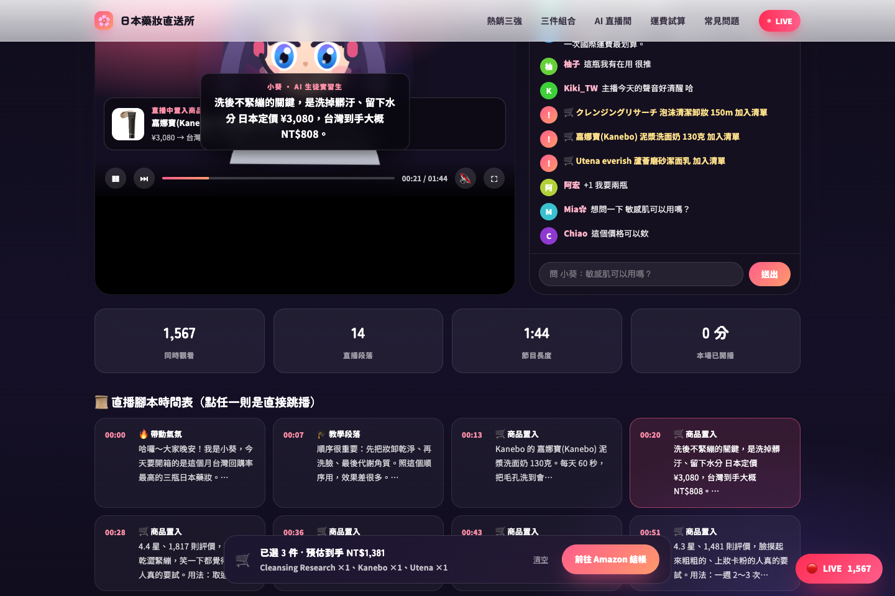
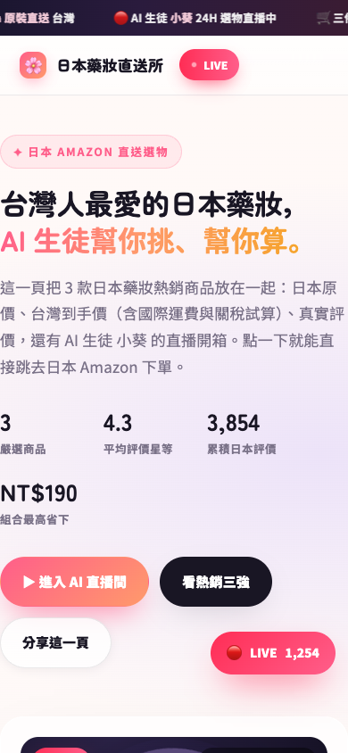

# 🌸 amazon-onepage-bot

**貼上日本 Amazon 商品網址 → 自動生成台灣市場的一頁式銷售網站（含 AI 生徒直播間）。**


<p align="center">
  
  
</p>

🔗 **Live Demo**
- Render：https://amazon-onepage-bot.onrender.com/
- GitHub Pages：https://809540023-lgtm.github.io/amazon-onepage-bot/

每次貼一個新網址，它就會自動抓取商品資料、寫好繁中銷售文案、算好含運費與關稅的台灣到手價，
然後把整頁重新產生一份。三個商品會被串成一套「卸妝 → 洗臉 → 代謝角質」的保養流程。

---

## 目前產出的商品（這一頁）

| # | 商品 | 日本價格 | 台灣到手價 | 評價 |
|---|------|---------|-----------|------|
| 1 | Kanebo 泥漿洗面奶 130g | ¥3,080 | NT$808 | 4.4★ / 1,817 |
| 2 | Utena everish 蘆薈磨砂潔面乳 135g | ¥347 | NT$258 | 4.3★ / 1,481 |
| 3 | Cleansing Research 泡沫清潔卸妝 150mL | ¥631 | NT$315 | 4.3★ / 556 |

排序依日本 Amazon 累積評價數（真實資料，非人工指定）。
三件合購 **NT$1,191**，比分開買省 **NT$190**（國際運費只收一次）。

---

## 快速開始

```bash
cd /Users/agmini/amazon-onepage-bot

# 1. 貼上一個日本 Amazon 商品網址（或直接貼 ASIN）
node generate.mjs "https://www.amazon.co.jp/dp/B000FQMR1O"

# 2. 一次貼多個也可以
node generate.mjs "https://www.amazon.co.jp/dp/B08R6ZHZHV" "https://www.amazon.co.jp/-/zh/dp/B07G5JQW5V?th=1"

# 3. 產生完順便用瀏覽器打開
node generate.mjs --open
```

不想打指令：**雙擊 `加入商品.command`**，會跳出輸入框讓你貼網址，貼完自動產生並開啟網頁。

### 其他指令

| 指令 | 用途 |
|------|------|
| `node generate.mjs --list` | 列出目錄裡所有商品 |
| `node generate.mjs --rebuild` | 不重新抓取，只用現有資料重做網站（改文案、改設計後用這個） |
| `node generate.mjs --refresh` | 重新抓取所有商品的即時價格與評價 |
| `node generate.mjs --open` | 產生後自動開瀏覽器 |
| `node generate.mjs --no-single` | 不輸出各商品的單品頁 |

---

## 產出檔案

```
docs/
├── index.html          ← 主頁：三個商品串在一起 + AI 直播間（單檔，可直接分享／上傳）
├── index.json          ← 商品清單索引
├── data.json           ← 這一頁的完整資料（價格試算、直播腳本…）
└── p/
    ├── B000FQMR1O.html ← 單品專用一頁式網站（每個商品各一份，方便單獨投放廣告）
    ├── B08R6ZHZHV.html
    └── B07G5JQW5V.html
```

`index.html` 是**完全獨立的單一檔案**（CSS／JS／AI 生徒頭像全是內嵌 SVG 與程式碼，沒有外部相依），
可以直接丟到任何靜態空間、LINE 群組或雲端硬碟分享。

---

## 這一頁包含什麼

| 區塊 | 內容 |
|------|------|
| Hero | AI 生徒（小葵）直播預覽卡、即時觀看人數、熱銷統計 |
| 熱銷三強 | 商品圖庫（可切換多張圖）、繁中標題、評價、日幣價 + 台灣到手價、賣點、規格、加入清單 |
| 三件組合 | 把三瓶排成 **STEP 1 卸妝 → STEP 2 洗臉 → STEP 3 代謝角質** 的使用流程，並算出合購省多少 |
| **AI 直播間** | 模擬 YouTube 直播：會講話的 AI 生徒（嘴型／眨眼／髮絲擺動）、同步字幕、跑馬燈、即時聊天室、觀看人數跳動、講到哪瓶就置入哪瓶的售價卡 |
| 運費試算器 | 調數量即時算出「商品金額 + 國際運費 + 關稅與營業稅」的台灣到手價明細 |
| FAQ / Footer | 常見問題、價格變動與免稅門檻說明、資料擷取時間與 ASIN |

### AI 直播間的互動

- **自動播放**：捲到直播區就會開始播，捲走自動暫停。
- **字幕同步**：14 段腳本（開場 → 逐瓶介紹 → 合購 → 收尾），依時間軸切換。
- **🔇 / 🔊 按鈕**：開啟後用瀏覽器內建語音（zh-TW）真的朗讀台詞，AI 生徒嘴型會跟著動。
- **聊天室**：可自己留言，AI 生徒會依關鍵字（運費／關稅／正品／敏感肌／到貨）回答。
- **腳本時間表**：點任一格可直接跳播那一段。

---

## 設定檔 `config.json`

| 欄位 | 說明 |
|------|------|
| `fx.fallbackJpyToTwd` | 抓不到即時匯率時的備用匯率（預設 0.2013） |
| `shipping.baseTwd` | 國際運費基本費（預設 95） |
| `shipping.perItemTwd` | 每件加收（預設 45） |
| `shipping.perKgTwd` | 每公斤加收（預設 160） |
| `customs.dutyFreeLimitTwd` | 免稅門檻（預設 2,000，台灣進口郵包規定） |
| `customs.dutyRate` / `vatRate` | 關稅 5% / 營業稅 5% |
| `marketing.brand` | 網站品牌名 |
| `marketing.promoDiscountRate` | 想再額外做折扣時填 0.05 = 95 折（預設 0，只算真實的運費合併優惠） |
| `ai.personaName` | AI 生徒名字（預設「小葵」） |

改完 `config.json` 後跑 `node generate.mjs --rebuild` 即可生效。

> ⚠️ 運費與關稅都是**估算值**，頁面上也這樣標示。實際金額一律以 Amazon 結帳頁與海關認定為準。

---

## 想真的開 YouTube 直播？

頁面裡的直播間是**模擬畫面**（用於一頁式網站的展示與導購）。
要把同一套內容變成真的 YouTube 直播，最省事的做法：

1. **OBS 場景**：開一個「視窗擷取」，來源就選瀏覽器裡的 `docs/index.html#live` 區塊
   （或用「瀏覽器來源」直接填 `file:///Users/agmini/amazon-onepage-bot/docs/index.html#live`）。
2. **字幕**：`docs/data.json` 裡的 `stream.segments[]` 就是完整腳本（含每段秒數），
   可以直接匯入 OBS 的「文字」來源逐段切換，或拿去給 TTS 產生配音檔。
3. **YouTube**：YouTube Studio → 建立 → 直播 → 用 OBS 推流。
   直播標題可直接抄 `data.json` 的 `stream.title`。
4. **聊天室**：想模擬熱鬧氣氛可用 OBS 的「瀏覽器來源」開啟本頁的聊天室區塊；
   真實開播時請關掉，改用 YouTube 原生聊天室。

---

## 專案結構（想改程式再看）

```
generate.mjs             CLI 主程式（抓取 → 建模型 → 輸出網站）
config.json              運費／關稅／匯率／品牌／AI 生徒設定
src/
├── amazon.mjs           抓取與解析日本 Amazon 商品頁（標題、價格、評價、圖片、規格、賣點）
├── http.mjs             抓取工具（Node fetch，被擋時自動退回 curl，含 gzip 處理）
├── fx.mjs               匯率取得（含快取）、國際運費與關稅試算
├── copywriter.mjs       「AI 大腦」：簡轉繁、繁中銷售文案、賣點、FAQ、直播腳本
├── avatar.mjs           AI 生徒「小葵」頭像（純 SVG，無外部圖檔）
├── theme.mjs            全站 CSS
├── client.mjs           前端互動（直播模擬、購物車、試算器、聊天室）
└── render.mjs           HTML 組裝
data/
├── catalog.json         商品資料快取（原始擷取結果，網站由此重建）
└── fx.json              匯率快取（12 小時）
scripts/verify.mjs       Playwright 自動驗收（版面、互動、JS 錯誤檢查）
```

### 自動驗收

```bash
node scripts/verify.mjs
```

會用 Chrome 實際開起來操作一遍：圖庫切換、直播播放、聊天室送出、購物車、試算器、
桌機／手機版面重疊與文字溢出檢查，最後列出所有 JS 錯誤（正常應該是 `(none)`）。

---

## 注意事項

- **價格會變**：日本 Amazon 的價格與庫存隨時變動，頁面上的資料是「擷取當下」的值。
  建議每次要投放前跑一次 `node generate.mjs --refresh`。
- **圖片版權**：商品圖片直接連到 Amazon 的圖片伺服器（`m.media-amazon.com`），
  版權屬於原品牌與 Amazon。
- **Amazon 反爬**：短時間大量抓取可能被 Amazon 暫時阻擋，程式已內建節流（每個請求間隔 0.9 秒）
  與 curl 備援；若真的被擋，稍等幾分鐘再跑即可。
- **免責聲明**：頁面底部的免責聲明已標明「價格、運費、稅金以 Amazon 結帳頁為準」，
  這是導購頁面該有的基本揭露，請不要移除。
